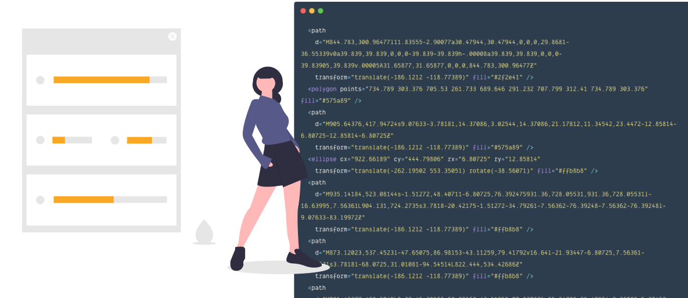
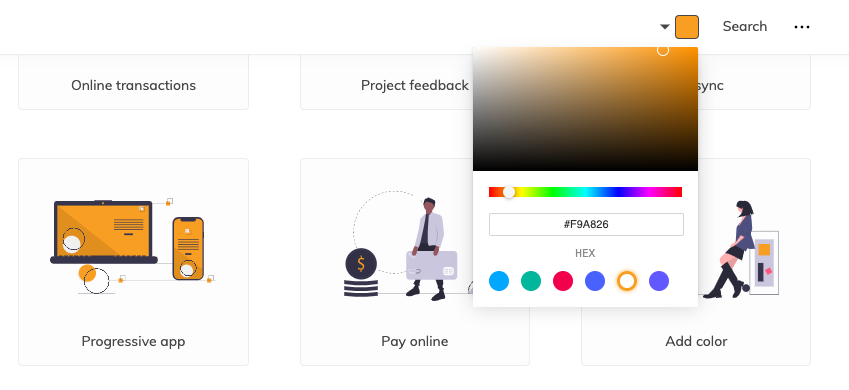
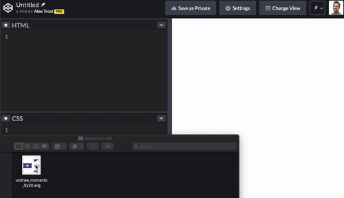
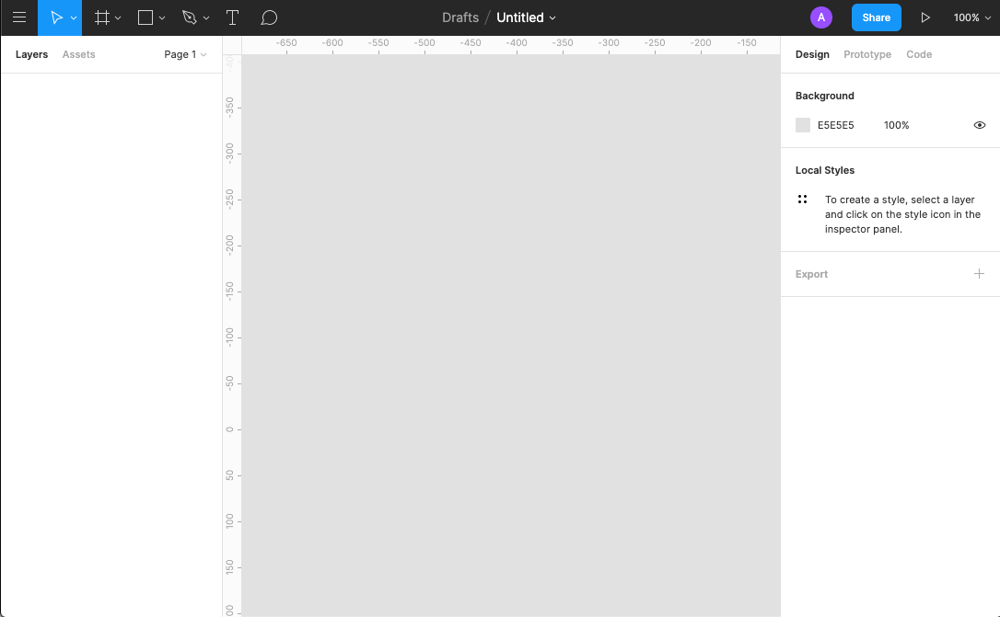
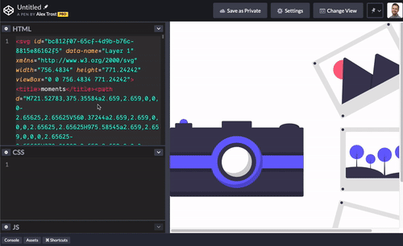
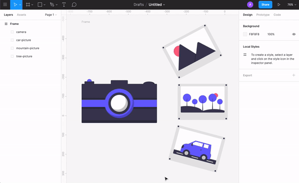
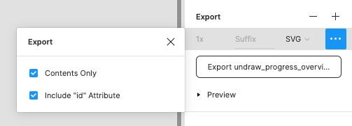
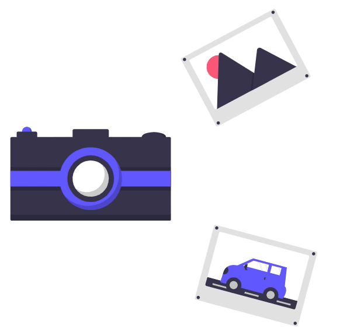
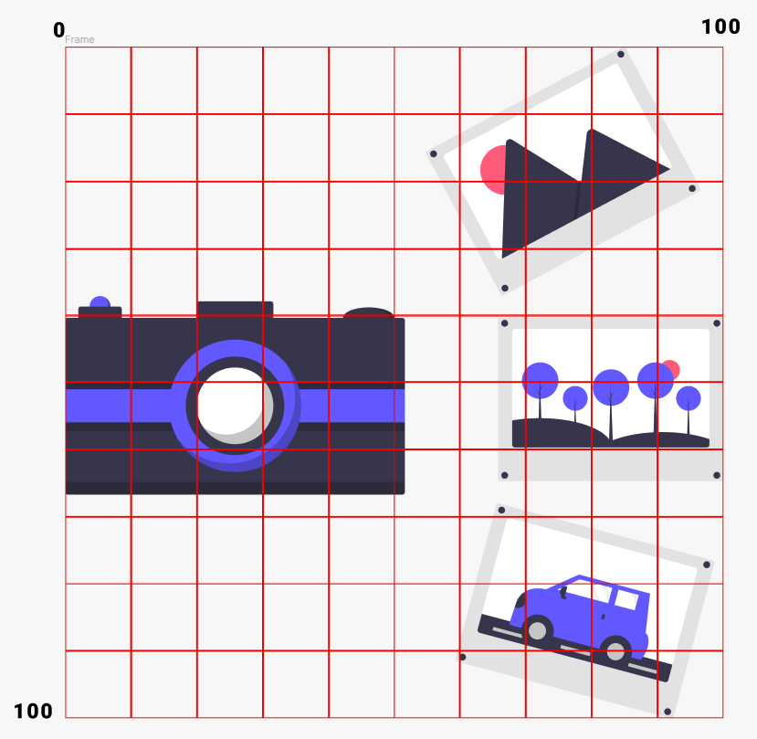

<iframe
  width="540"
  height="315"
  src="https://www.youtube-nocookie.com/embed/_i5w8XR-EXc"
  frameborder="0"
  allow="accelerometer; autoplay; encrypted-media; gyroscope; picture-in-picture"
  allowfullscreen
></iframe>

---

There's a big trend right now to have a colorful illustration on your homepage showing what you or your product does. There's a 'flat' style that's ubiquitous on the web, thanks to sites like [UnDraw](https://www.undraw.co).


It's a great style with clean shapes, but when everyone is using the same illustrations, how can you stand out? With a touch of animation!

Animations can help communicate your message and add delight to an otherwise dull experience. However, animating these illustrations with CSS, GreenSock, or other animation libraries, can get tricky.

If you open one of these SVGs with many shapes, you'll quickly see a problem. It's difficult to tell which shapes come from which code elements.



Can you tell which `<path>` creates her shoe? I can't. There are almost 40 elements in this illustration, and many graphics are even more complicated. With a few techniques, we can make animating these illustrations much easier.

## Getting a Vector Image

First, let's choose a vector image from a resource site. Here are a few sites you can explore.

- [UnDraw](https://undraw.co/illustrations) (Free, no attribution required)
- [Humaaans](https://www.humaaans.com/) (Free, attribution required)
- [Vecteezy](https://www.vecteezy.com/) (Free, attribution required)
- [Vexels](https://www.vexels.com/) (Paid service, no attribution required)

Pick one, grab something that catches your eye. For the sake of this tutorial, I suggest UnDraw. The one I'm using is called "Moments."

Note: click at the top right, and you can change the accent color to match your brand.



Then click "Download SVG for your projects."

## Take a Look in CodePen

Head over to [Codepen](https://codepen.io) and start a new pen.

Fun tip! You can drag and drop the file right into CodePen's HTML editor, and it inserts the code for you.



Now take a look at the code. There's a lot there, and without IDs to provide names, we're pretty lost. Plus, there are no groups that combine similar items, so making those pictures move across the screen is challenging.

Luckily, we can use a tool that's great for working with SVGs: [Figma](https://www.figma.com).

## Using a Vector Program

"But Alex, I'm not a designer! I don't know how to use these apps!"

I promise we're only going to select some items and rename them. No design chops required!

We need a vector program so we can name elements and create groups visually, rather than through the code. Once organized, working with the code is much more accessible.

Many different apps can handle vectors well. We're using Figma because:

1. It's _free_
2. No download required
3. It's cross-platform

Sign up for a Figma account and create a new file. You'll see a workspace divided into three columns.



### Importing

Now select _all_ the SVG code you just pasted into CodePen and paste it into Figma. Figma automatically creates vector shapes!



_Note_: I recommend this copy-and-paste method over importing SVG files, as it doesn't give you extra Figma frames to deal with.

### Grouping and Naming

Your vector image is now in the center workspace. On the left, you'll see a list of all the elements in your scene, and a tiny version of their shape.

I'm going to group and name the camera first. Click and drag to draw a selection box around items you want to group.


Keep grouping and naming items until every shape has a home.


Much better!

For my scene, I want to animate the pictures together and separately, so I'm going to give them all a group called `picture-group`.



I now have a group of groups.

### Exporting

Now that we grouped and labeled our illustration how we want it, it's time to export. Click "Frame" on the left sidebar to select everything in your scene. On the right sidebar, click "Export" at the very bottom. Choose SVG and click the `...` and select `Include "id" Attribute`. If you don't, Figma won't include the names we added.



Click the Export button and save your file.

Head back to CodePen and delete the code we dropped earlier. Then drag and drop your new file and take a look. Your image should look the same, but the code should have the groups and ids we applied in Figma.


If you see all your groups, great! If not, double-check your export settings.

## Animating with CSS

We've made our code a bit more readable and manageable, so we're ready to animate!

At this point, you can reach for any animation method you want. [GreenSock](https://greensock.com/) and [React Spring](https://www.react-spring.io/) are two of my favorites, but we'll use CSS animations to finish out this tutorial.

It's good to have a concept for your animation. For mine, the pictures will slide out from behind the camera in a stack, and then spread out to form the final image. We need to animate the pictures together and individually, which explains our grouping. The camera won't move, so we didn't/have/ to group and name it, but it's helpful to have everything organized.

First I want to give our SVG some styles to keep it centered within the viewport. I’ll add an `id` to the SVG and target it with CSS.

```html
<svg
  id="camera-illustration"
  width="757"
  height="772"
  viewBox="0 0 757 772"
  fill="none"
  xmlns="http://www.w3.org/2000/svg"
>
  ...
</svg>
```

```css
#camera-illustration {
  margin: 2rem auto;
  display: block;
  max-width: 80vw;
  max-height: 90vh;
}
```

Next, we want to animate the photo of the trees in the center. We'll be using CSS keyframes to control the timing of our animations. Here's a quick overview if you're not familiar.

### Keyframe Overview

With keyframes, we declare what happens throughout the sequence of an animation. We add keyframes to HTML elements with the `animation-name` property.

This animation transitions an element from invisible to visible.

```css
@keyframes fade-in {
  from {
    opacity: 0;
  }
  to {
    opacity: 1;
  }
}
```

We can also write our keyframes using percentages, which allows us to declare properties throughout the animation.

```css
@keyframes color-change {
  0% {
    background-color: red;
  }
  50% {
    background-color: purple;
  }
  100% {
    background-color: blue;
  }
}
```

This animation changes the background color from red to purple halfway through the animation, then to blue at the end. If the animation were 10 seconds long, it would turn purple 5 seconds in.

One important detail we'll use for animating these images: If you don't declare a starting or endpoint, the browser uses the existing property values. That means when we move objects to start the animation, the browser resets them to their original properties.

### Creating our Keyframes

Let's add a keyframe animation called `trees` to our CSS file.

```css
@keyframes trees {
  from {
    transform: translate(-400px, 0);
  }
}
```

We use the `transform` property to manipulate our object, giving it the `translate` value. Translate moves elements left and right (on the X-axis) as well as up and down (on the Y-axis) in that order. `transform: translate(x, y);`

We want the photo to start under the camera, so we shift it left by 400 pixels. We're not moving it up or down, so we enter 0.

Now we need to tell the browser which element should use this keyframe. Using the id we made earlier, let's add some styles to `#tree-picture`.

```css
#tree-picture {
  animation-name: trees;
  animation-duration: 3s;
  animation-iteration-count: infinite;
}

@keyframes trees {
  from {
    transform: translate(-400px, 0);
  }
}
```

We give the animation's name we declared above, then say how long we want the animation to last. `animation-iteration-count` determines how many times you want it to loop. While building, we'll use `infinite`, but that can quickly get annoying on a website, so you'd probably use a value of `1`. If you want it to back and forth, `alternate` works great!

We've got our first bit of animation; well done!



From here, we'll continue to add keyframes for the different parts and animate them using only `transform` and `opacity`. There's a lot you can do with just those two.

When rotating individual items, we need to be aware of the `transform-origin`. The origin is the point by which we're rotating something. We want to rotate items by their origin, so if we think of the SVG as a grid, we can see the mountain picture is positioned around '75 %, 15%`. We'll use that for its origin.



```css
#mountain-picture {
  transform-origin: 75% 15%;
  animation-name: mountains;
  animation-duration: 3s;
  animation-iteration-count: infinite;
}

@keyframes mountains {
  from {
    transform: translate(-350px, 240px) rotate(30deg);
  }
  50% {
    transform: translate(-50px, 240px) rotate(30deg);
  }
}
```

We've also created the keyframes for this photo. I'll point out a couple of things:

1. They have two steps, `from` and '50 %`. This gives the animation a start, middle, and end.
2. They use `translate` AND `rotate`. To do more than one transform at a time, you just separate them with a space. `30deg` stands for 30 degrees, and it levels out the photo.

We do the same thing for the car photo, but our `translate` value for the Y-axis is negative, as it finishes below the camera.

```css
#car-picture {
  transform-origin: 70% 80%;
  animation-name: car;
  animation-duration: 3s;
  animation-iteration-count: infinite;
}

@keyframes car {
  from {
    transform: translate(-400px, -200px) rotate(-23deg);
  }
  50% {
    transform: translate(-100px, -200px) rotate(-20deg);
  }
}
```

Great! Now the last touch is to animate the `picture-group` we made.

We're going to use `scale` to shrink the photos at the beginning of the animation. For that, we need to be aware of the `transform-origin`. Looking at the grid, we see the center of the camera is at '25 % 50%`. That's where we want to scale from.

```css
#picture-group {
  transform-origin: 25% 50%;
  animation-name: pictures;
  animation-duration: 3s;
  animation-iteration-count: infinite;
}

@keyframes picture-group {
  from {
    opacity: 0;
    transform: scale(0.6);
  }
  33% {
    opacity: 1;
  }
}
```

`scale(0.6)` makes the group 60% of its original size. We take opacity from 0 to 1 for a nice quick fade in.

<iframe
  height="500"
  style="width: 100%;"
  scrolling="no"
  title="Animate Undraw Demo"
  src="https://codepen.io/a-trost/embed/preview/57319e224a801ffb380e23f0ba1d829e?height=387&theme-id=light&default-tab=css,result&editable=true"
  frameborder="no"
  allowtransparency="true"
  allowfullscreen="true"
>
  See the Pen{" "}
  <a href="https://codepen.io/a-trost/pen/57319e224a801ffb380e23f0ba1d829e">
    Animate Undraw Demo
  </a>{" "}
  by Alex Trost (<a href="https://codepen.io/a-trost">@a-trost</a>) on{" "}
  <a href="https://codepen.io">CodePen</a>.
</iframe>

And that's it! You've now learned how to animate your organized SVG.

Now you can set the `animation-iteration-count` to 1 to not annoy your visitors. But what if the animation is halfway down the page? They'll miss it by the time they scroll down. That's when we can use the [intersection observer API](https://developer.mozilla.org/en-US/docs/Web/API/Intersection_Observer_API).

## Using Intersection Observers for Timely Animations

The intersection observer API tells us when an element is /intersecting/ with the viewport. In other words, the user can see it.

<iframe
  height="500"
  style="width: 100%;"
  scrolling="no"
  title="Undraw Animation - Intersection Observer"
  src="https://codepen.io/a-trost/embed/preview/4140942a16322638c64d0db721a63d38?height=465&theme-id=light&default-tab=result&editable=true"
  frameborder="no"
  allowtransparency="true"
  allowfullscreen="true"
>
  See the Pen{" "}
  <a href="https://codepen.io/a-trost/pen/4140942a16322638c64d0db721a63d38">
    Undraw Animation - Intersection Observer
  </a>{" "}
  by Alex Trost (<a href="https://codepen.io/a-trost">@a-trost</a>) on{" "}
  <a href="https://codepen.io">CodePen</a>.
</iframe>

It’s just a bit of boilerplate JavaScript:

```js
const images = document.querySelectorAll(".illustration-to-animate");

observer = new IntersectionObserver((entries) => {
  entries.forEach((entry) => {
    if (entry.intersectionRatio > 0) {
      entry.target.classList.add("animate");
    } else {
      entry.target.classList.remove("animate");
    }
  });
});

images.forEach((image) => {
  observer.observe(image);
});
```

We can now add the class `illustration-to-animate` to multiple items on our page, and they'll trigger as you scroll into view!

## Wrap Up

If you made it this far, well done! You're more than prepared to make stock SVGs your own with custom animations! I'd love to see what you come up with, so feel free to reach out.
