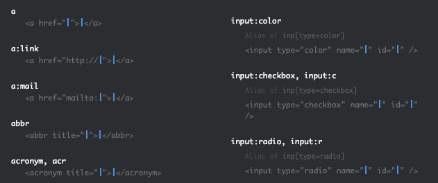

Writing HTML and CSS can get painfully repetitive. One of the best ways to increase your productivity is to make your creation of code faster. Emmet’s here to help.

Emmet is a plugin for your favorite code editor that makes HTML and CSS generation seem like magic. It’s great for cutting out the repetitive bits of code that comes with writing HTML and CSS.

Emmet has been around for a while and is pretty ubiquitous across a lot of code editors, so you might have used it before.

No matter your experience with Emmet, if you don’t consider yourself an Emmet master, you’ll probably pick up something useful from the tips below.

## Setup

If you’re using Visual Studio Code like me, Emmet comes built in. If you’re using Sublime, Atom, or anything else, [installation is easy](https://emmet.io/download/).

The easiest way to see if Emmet is set up and working properly is to open an HTML file in your editor, type `div` and then press the Tab key. If it turns into `<div></div>` then you’ve got Emmet up and running.

## Tab is the Key

For every command you see below, the way you tell Emmet to do its thing is to hit `tab` while your cursor is at the end of the line.

If Tab doesn’t make the code appear, you might have a typo or have your cursor in the wrong place. Usually erasing the last letter, typing it again and hitting `tab` makes it work.

## Faster HTML

Let’s start with an empty HTML file. There’s a lot that goes into a standard HTML file that Emmet can do for us.

### Boilerplate HTML Setup

`!` gives us:

```html
<!DOCTYPE html>
<html lang="en">
  <head>
    <meta charset="UTF-8" />
    <meta name="viewport" content="width=device-width, initial-scale=1.0" />
    <meta http-equiv="X-UA-Compatible" content="ie=edge" />
    <title>Document</title>
  </head>
  <body></body>
</html>
```

In your code editor, you’ll notice that a few parts of the code are highlighted, with your cursor starting on `device-width`. Emmet knows that some of these are sometimes changed, while the rest is pretty standard. Here’s how mine looks:


I suggest tabbing until you get between the `<title>` tags and changing that.

Let’s insert a quick CSS link with `link:css`:

```html
<link rel="stylesheet" href="style.css" />
```

### Angular, Vue or React components

Emmet will make anything you hit tab on into an element, which makes it perfect for the custom named components in frameworks like React, Angular and Vue. No need to type it twice or worry about angle brackets.

A tab after `MyCoolComponent` quickly becomes

```html
<MyCoolComponent></MyCoolComponent>
```

### Children

The syntax for creating a child element is to separate them with a `>`.

`div>ul>li` gives us

```html
<div>
  <ul>
    <li></li>
  </ul>
</div>
```

### Siblings

To put two elements on the same line, use `+`.

`div>p+p+p` gives us

```html
<div>
  <p></p>
  <p></p>
  <p></p>
</div>
```

### Climbing Up

To go up a level we use the caret: `^`

### Multiplication

This is where Emmet can save you a ton of time. Let’s make two containers, each holding three cards with two lists and 5 items on each. Sixty elements total. Sound like a lot of typing?

All you need is `.container*2>.card*3>ul*2>li*5`to create those 100 lines of code.

#### Use the Index

Sometimes you want to include the index of your multiplication so that the items are unique in some way.

Using `$` lets you put that number in as class names, IDs or even text inside the element.

`ul>li.item.item$*5` gives

```html
<ul>
  <li class="item item1"></li>
  <li class="item item2"></li>
  <li class="item item3"></li>
  <li class="item item4"></li>
  <li class="item item5"></li>
</ul>
```

### Set the Text

Emmet can even set the text inside your elements if you use curly brackets `{}`.
This is especially handy when combined with the `$`.

`div*3>h2{Header $}+p{Body text $}`

```html
<div>
  <h2>Header 1</h2>
  <p>Body text 1</p>
</div>
<div>
  <h2>Header 2</h2>
  <p>Body text 2</p>
</div>
<div>
  <h2>Header 3</h2>
  <p>Body text 3</p>
</div>
```

### Classes

Emmet provides a few ways to create HTML elements with classes by using the same `.` syntax you use in CSS.

Follow the element type with the class you want to assign it and Emmet does the rest.
`section.sidebar` creates

```html
<section class="sidebar"></section>
```

#### Multiple Classes

To add multiple classes string them together without a space: `.container.dark.shadow.medium`

```html
<div class="container dark shadow medium"></div>
```

#### Div by Default

By default, Emmet will assume you’re trying to create a div, so just type the class name as a shorthand.
Typing `.container` outputs a div with that class

```html
<div class="container"></div>
```

#### Context Defaults

Emmet’s pretty smart, and if you give it some context it’ll swap the div for other elements.
If we enter `ul>.item` it’ll assume we want a list item with that class:

```html
<ul>
  <li class="item"></li>
</ul>
```

Creating an item inside a paragraph tag defaults to a span.
`div.container>p.body>.highlight` creates

```html
<div class="container">
  <p class="body"><span class="highlight"></span></p>
</div>
```

### Lorem Ipsum

For the longest time, I’d go to google, search for `lorem ipsum` and pull up one of the generators just to get the standard dummy text. Emmet takes the command `lorem` and saves you the trouble.
`p>lorem`

```html
<p>
  Lorem ipsum dolor sit amet, consectetur adipisicing elit. Voluptas aspernatur
  unde maxime numquam ullam. Corporis nihil culpa error delectus, debitis
  facilis, suscipit nostrum, ipsam numquam corrupti natus? Iure, distinctio at.
</p>
```

Add a multiplier like `p*4>lorem` to get that number of paragraphs and never leave your code editor.

### Perfect Cursor Placement

If you look at the [cheat sheet](https://docs.emmet.io/cheat-sheet/), you’ll see that many of the shortcuts have two blue lines. Emmet intelligently sets you up so that you can tab between the fields you need to fill in. The blue lines are where your cursor will go after you hit tab.



## Speedy CSS

CSS finds you writing a LOT of the same thing over and over. Let’s speed that up.

Emmet works a little differently for CSS than HTML, performing a fuzzy search when you’re typing inside a class or element declaration.


My suggestion is to check the [cheat sheet](https://docs.emmet.io/cheat-sheet/) and figure out the shortcuts for your most used properties.

Here are some of my most used that I’ve gone and committed to heart.

### Layout

`display: flex;` = `df`
`justify-content: flex-start;` = `jc`
`align-items: flex-start;` = `ai`
`box-sizing: border-box;` = `bz`

### Margin & Padding

`margin: 1rem;` = `m1r`
`padding: 1rem;` = `p1r`

### Fonts + Styling

`font-family: serif;` = `ff`
`font-size: 16px;` = `fz16`
`color: #000;` = `c`
`background: #000` = `bg`
`border: 1px solid #000;` = `bd+`

When using editors like VSCode they will often show you options as you start to type. So even if you don’t have what you want memorized, you can type some of the letters and hit tab once it shows you what you’re looking for.


### Now Go Practice

Hopefully, some of these Emmet commands are new to you. You might not know them at first but practice with them so that you begin to commit them to memory. A bit of struggle in the beginning is going to pay dividends over your career.
