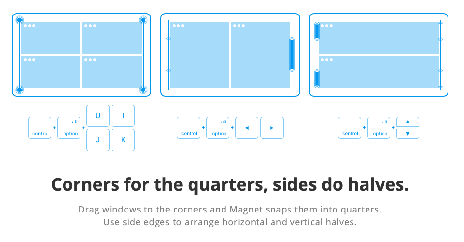
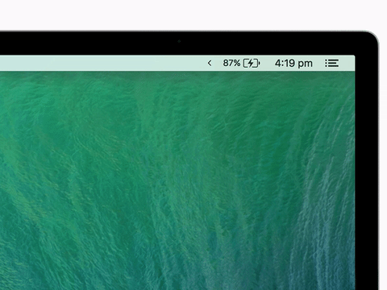
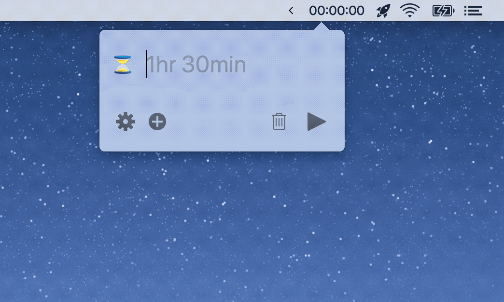
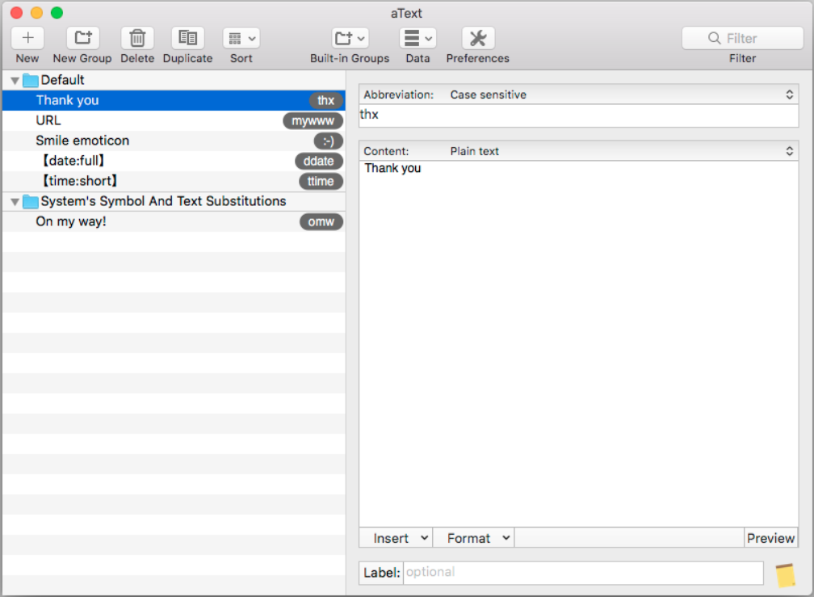
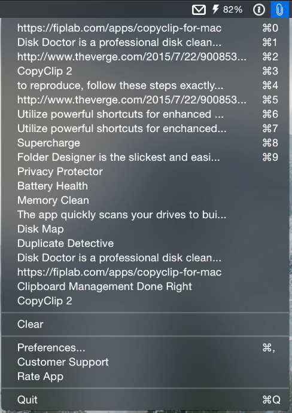
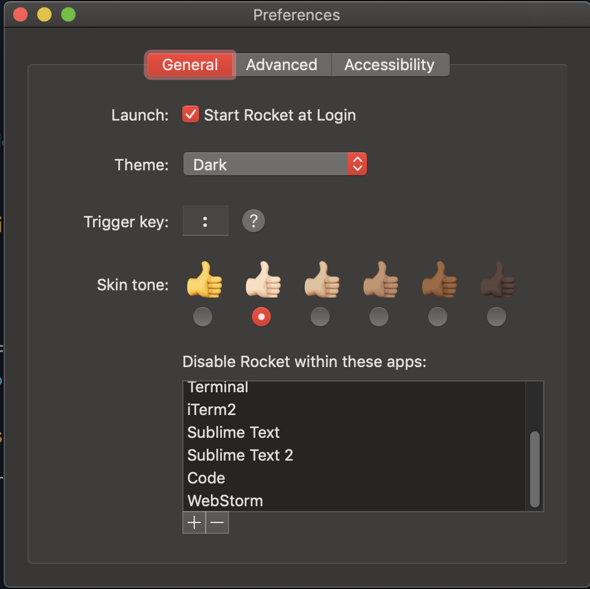

Tools created to solve one problem often solve that problem best.

Swiss army knives are convenient, but they’re not the best bottle-opener, nail file or saw.

These little **macOS apps** do one or two things well and I consider most of these to be essential.

Grab a couple if you’re looking for a cleaner, faster, and more productive workflow.

Most are free, a couple are under \$5.

## Magnet - Window Organization

Arranging windows, especially with multiple screens, can be a hassle. Magnet makes it easy to set apps to whatever fraction you’d like. Full, half, thirds, fourths - whatever you want, it’s easy with Magnet.

You trigger Magnet by keyboard shortcut or dragging a window to the edges of the screen. It snaps into place and gives you perfect proportions.

Magnet even allows you to move windows across screens. With a few keyboard strokes, my code editor moves from the left monitor to the right monitor.

Easily one of my most-used apps and the first thing I install on new computers. It even works on vertical screens! For \$1 it’s surprisingly robust.

**Price**: $1\
**Website** [Magnet Website](https://magnet.crowdcafe.com/)

## Vanilla - Tidy Toolbar

If you’re running all the apps on this list, your toolbar will be pretty cluttered. You might already have 10 icons across the top of your screen, driving you insane.

That’s where Vanilla comes in.

With an open/close toggle, it tucks away the icons you want hidden. I only want to see my volume, battery and the time. Other than that, everything gets folded into Vanilla’s drawer.

If you like clean desktops and minimal clutter, Vanilla is a must-have.

So fresh. So clean.

**Price**: Free (Pro versions available)\
**Website**: [Vanilla Website](https://matthewpalmer.net/vanilla/)

## Dato - Time Toolbar++

Dato looks identical to the macOS clock, but when clicked you get so much more.

That might seem like a trivial improvement over the regular toolbar, but I’ve already used it many times in the 3 days I’ve had it.

When you open it, you get a little calendar, events for the day, and you can even add time zones that you care about.

Having quick access to a calendar is handier than you might think right now. You’ll use it. Trust me.

**Price**: Free\
**Website**: [Dato Website](https://sindresorhus.com/dato)

## Horo - Easy Timer

Horo is a great little timer that lives in your toolbar. It understands natural language, so typing `30m` or `30 minutes` both get you a 30-minute timer.

Horo’s developer, Matthew Palmer, says:

> If starting a timer takes more than a second, your timer app sucks.

I agree. Horo can handle multiple timers, is effortless to start, and best of all it’s free. Grab it.

**Price**: Free (Pro version available)\
**Website**: [Horo Website](https://matthewpalmer.net/horo-free-timer-mac/)

## aText - Text Expansion

If you have a snippet plugin for your IDE, you probably know just how great it is to type a few letters and get lines of code generated for you.

On the iPhone, there are handy typing shortcuts, like `omw` expands to “On my way!”

aText brings that functionality and then some. The developer explains:

> aText accelerates your typing by replacing abbreviations with frequently used phrases you define.

aText is great for boilerplate text like email responses or journaling templates. It’s a massive timesaver.

It can even insert images, the current date/time, AppleScript, Shell Script, etc. Check out the trial.

**Price**: $5\
**Trial**: 21 Days\
**Website**: [aText Website](https://www.trankynam.com/atext/)

## CopyClip - Clipboard History

As a programmer, you’re doing a lot of copying and paste. (Insert Stack Overflow joke here)

The problem is the clipboard only fits 1 item at a time. If you copy something new, the last item is gone forever.

That’s where CopyClip helps. Instead of losing each item copied, it hangs on to your last 20 or so. Don’t worry, you can also clear the clipboard to remove sensitive info.

As one reviewer puts it, CopyClip is an “invaluable time and stress reliever.”

**Price**: Free\
**Website**: [Apple Appstore](https://apps.apple.com/us/app/copyclip-clipboard-history/id595191960?mt=12)

## Karabiner - Custom Keyboard

Karabiner is a power-user’s dream. It allows you to remap your keyboard however you want. Karabiner lets you set up custom hotkeys for pretty much anything.

The same way you can create snippets and shortcuts in VSCode, you can set keyboard shortcuts across your entire OS.

I recently found a great use case for it when I started using a Windows keyboard at work.

The Mac and Windows keyboards are the same, but `command` and `alt` buttons are flipped, so I kept making mistakes. Easy Karabiner change.

**Price**: Free\
**Website**: [Karabiner Website](https://pqrs.org/osx/karabiner/)

## Amphetamine - Screen Espresso

Sometimes you need your computer to stay on to finish an install or run tests, or whatever else.

Amphetamine stops your computer from going to sleep until you turn it off.

Simple app, handy function. Give it a spin.

**Price**: Free\
**Website**: [Apple Appstore](https://apps.apple.com/us/app/amphetamine/id937984704?mt=12)

## Muzzle - Auto DND

Muzzle blocks potentially embarrassing alerts while screen sharing.

It’s good practice to put your computer on Do Not Disturb whenever you have people watching your screen. Muzzle recognizes when you’re sharing your screen and triggers DND for you. When you’re done, it toggles it off.

Even if you don’t download it, check out the website for a few laughs and an excellent lesson on how to show a product’s value.

**Price**: Free\
**Website**: [Muzzle Website](https://muzzleapp.com/)

## Toothfairy - Better Bluetooth

Connecting your AirPods or other Bluetooth headphones to your MacBook can be a pain.

Toothfairy makes connection dead simple. Connect with a menu bar click or even set up a keyboard shortcut.

Toothfairy lets you create an icon in your toolbar for each Bluetooth device. Icons let you know when you’re connected and when your battery is running low.

Do you switch your headphones between your phone and laptop often? Toothfairy is worth the 5 bucks.

**Price**: $5\
**Trial**: Nope\
**Website**: [Apple Appstore](https://apps.apple.com/us/app/toothfairy/id1191449274?mt=12)

## Kap - Screen Recorder

Kap is the quickest way I’ve found to create GIFs from my screen. Set the aspect ratio, select the area, and click record.

Easily convert snippets of videos or your latest CodePen into a repeating GIF. Then share to Twitter, Reddit, Giphy, Slack, wherever.

Kap also features a bunch of plugins to make sharing or saving even faster.

**Price**: Free\
**Website**: [Kap Website](https://getkap.co/)

## Rocket - Quick Emojis

If you use emojis often, this one’s a must-have.

Not all apps allow for quick and easy emoji-ing. Slack has introduced us to the excellent `:dog:` = 🐶 emoji shorthand. Rocket spreads that same functionality everywhere.

Type a colon, start typing, and watch the autocomplete matches populate.

Rocket even lets you choose which websites and Apps to not run in, so it won’t get annoying when you’re programming.

**Price**: Free\
**Website**: [Rocket Website](https://matthewpalmer.net/rocket/)

## Wrapping Up

If you know of any other great apps that solve one or two problems, please let me know! Hopefully, you’ve found an app on this list to make your day go a bit smoother.

I think this kind of app is a great way for any developer to think about creating products. Don’t try to be Evernote with 1,000 features. Identify your problem and solve it well.
