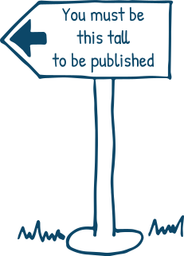
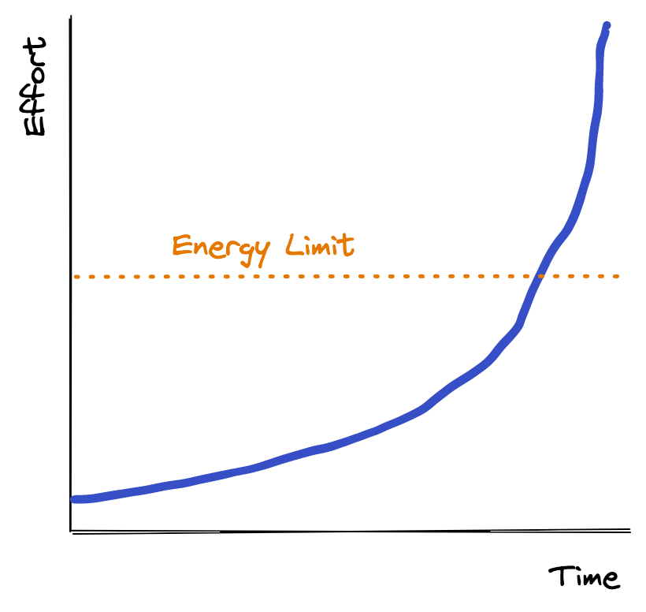

This _one thing_ keeps me from creating consistently, and it's the most damaging habit I have as a content creator.

## The Best is Yet to Come

When I get into a rhythm of creating, I eventually find myself falling into a trap. I want the next thing I put out to be bigger and better than the last. Anything less feels like a disappointing step backwards.

<CenterContent>

  The always-rising carnival sign

</CenterContent>

Of course, this is nonsense. Could you imagine if the New York Times was longer with each issue? This thought process doesn't take much debunking. It's absurd after a dozen iterations, maybe even sooner.

## Dopamine Driven Development

Part of it comes from chasing more numbers. More sign-ups, more likes, shares, praise, etc.

I wish I could say I was unaffected by other people's opinions of my work. I wish I could care about the craft and write for the sake of it. That's the goal.

I know everyone is affected by the dopamine hits of likes, shares, comments, and praise. It's the entire reason Facebook and Twitter are billion-dollar companies.

Because I want this positive feedback, I raise the bar on what is releasable. Every article that passes through bumps the bar a bit higher. The effort bar starts small and moves up with each publish.

Even worse, if an article doesn't do so great, my monkey brain says, "Ah, it's because you didn't put enough effort in! You'll need to work harder to get another sweet dopamine hit."

## Long Term Improvement

It's not entirely misguided. I want to grow and improve, so making each article better than the last fits with that mindset. The big mistake is focusing more on the final product than the process.

If we compare it to exercise, we might spend an hour at the gym three times a week. As we improve, we don't spend more hours each day. Instead, we increase the weight, speed, or intensity of the session.

I want to view my articles and writing as the process and put less on the publishing action.

It's about spending an hour every day putting in the work. The writing improves when you practice it. When I edit and revise, it becomes better. That's the bar that goes up.

My skill as a writer inches up every day with a habit like that. My code demos, skills, and insight improve as I learn more and I learn through writing.

## Repetitions are your Friend

There's a great anecdote that James Clear explains in his [blog post on avoiding perfectionism](https://jamesclear.com/repetitions):

> Everyone on the left side of the classroom, he explained, would be in the “quantity” group. They would be graded solely on the amount of work they produced. On the final day of class, he would tally the number of photos submitted by each student. One hundred photos would rate an A, ninety photos a B, eighty photos a C, and so on.

> Meanwhile, everyone on the right side of the room would be in the “quality” group. They would be graded only on the excellence of their work. They would only need to produce one photo during the semester, but to get an A, it had to be a nearly perfect image.

At the end of the experiment, all of the best photos were created by the "quantity" group. By putting the repetitions in, they were able to achieve what the "quality" group was seeking all along. James explains:

> During the semester, these students were busy taking photos, experimenting with composition and lighting, testing out various methods in the darkroom, and learning from their mistakes. In the process of creating hundreds of photos, they honed their skills. Meanwhile, the quality group sat around speculating about perfection.

## Lowering the Bar

We need to lower the bar for what is acceptable. Small experiments, tiny demos, imperfect blog posts.

My friend [Cassie](https://cassie.codes) gave me this advice, and it has helped _so_ much. Writing, publishing, everything needs to have a higher frequency and lower bar.

It's not just writing, either. I've done this with _so many_ different forms of 'content.'

I spent a month learning Blender. The original idea was to spend an hour each day and post my progress to Twitter to "Show My Work." What started out as a simple render every day quickly turned into hours spent trying to make something better.

The same thing happened when I spent a month learning how to animate SVG. Moving circles and squares soon turned into entire scenes with custom illustrations and different web APIs.

This is the path most of my projects take.

<CenterContent>

</CenterContent>

Once we hit that dotted line, I'm spending way too much of my free time trying to make the most ambitious and incredible thing I've ever made. That self-imposed pressure not only makes me miserable but guarantees that the project won't get released any time soon. It'll never be 'ready.'

## Great Examples

<DraftContent>

I need to clarify that this isn't "Lower the Quality." This isn't an ode to laziness or low-quality work. It's about shipping and iterating. It's about scope creep. It's about creating for the sake of creating, not chasing 'likes.'

## Outline

- My issue
- Proof that it's bad
- The solution
- Winning Examples
  - ilithya
  - Beeple

</DraftContent>
