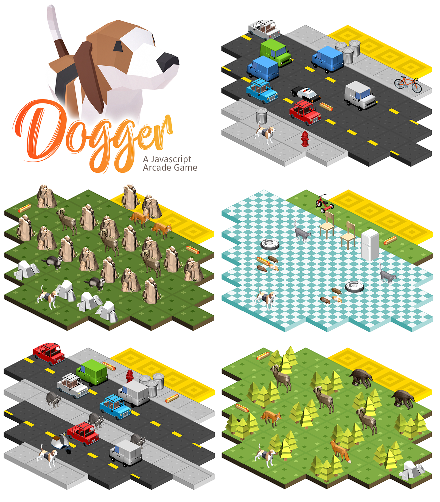

For my Udacity course work I was tasked with making an “arcade game clone” in the form of Frogger. They provided a general game engine as well as some stock image resources. [Here’s their repo.](https://github.com/udacity/frontend-nanodegree-arcade-game)

I saw a lot of potential in this project to make something beyond [the example they provided](https://youtu.be/kaifTslArtY).

## Inspiration

I drew inspiration from games like [Crossy Road](https://en.wikipedia.org/wiki/Crossy_Road) and [Lara Croft Go](https://en.wikipedia.org/wiki/Lara_Croft_Go) with its isometric perspective and space-by-space movement style. Plus their happy embrace of polygons reminded me of the new treasure trove that is [Google Poly](https://poly.google.com/).


## Features to Add

I wanted a few more features than the game needed to pass requirements. Some additions were fun music, high scores, designed levels, touchscreen input, and the home-baked image assets.

## Making the Image Assets

A good amount of my time spent went into the visual style and the assets created for the game. I picked assets all made by Google to keep the style similar throughout the game. They have some really incredible stuff (Like this gorgeous [hamburger](https://poly.google.com/view/eke7qcu_FR2)!).

I'll write a tutorial soon for how to turn those obj files into pngs that all face the right way with consistent lighting, perspective, etc. In the meantime, if you want to take a look at a cleaned up version of the PSD file I was using, [click here](https://drive.google.com/file/d/1a2uoN9e_KBTqo28-KJ1v4ixJApho2Sbo/view?usp=sharing). Feel free to use it to learn from or for use in any project. Just make sure you credit Google if you use any of the .obj files in your projects.

## Writing the Code

Part of the assignment was to use classes and inheritance, so I created character classes that my Player and Enemy objects would extend.

I knew I wanted to have some fun with the level design, so rather than opting for a random level generator that you'd see in an infinite kind of game, I opted for set levels. I also wanted different 'worlds', so the dog travels from the house to the forest to the city with matching enemies in each.

To set the characters for each level with a list of enemies. This is one of the hamsters on the first level:
`{ character: 'hamster', row: 2, col: 2, speed: 50, direction: 'r' }`
`row` and `col` tell it where to start, direction is `r` or `l`. Change the character name and the texture changes. Textures, barriers and hotdogs are placed in a similar way.

## Git

For this I had specific [Udacity Style Guidelines](https://udacity.github.io/git-styleguide/), and I tried to adhere to them with my Git commits as much as possible. Specifically the Style part of the git commits:

```
The type is contained within the title and can be one of these types:
feat: a new feature
fix: a bug fix
docs: changes to documentation
style: formatting, missing semi colons, etc; no code change
refactor: refactoring production code
test: adding tests, refactoring test; no production code change
chore: updating build tasks, package manager configs, etc; no production code change
```

I understood the principles of Git, but titling my commits was awkward, so I loved this kind of structure to help me out. I did end up overusing ‘feat’ and need to polish up a lot of the commits to make them read better.

## Problem Solving

Developing different aspects to the game definitely caused me to have to solve problems on parts of the project.

To have the isometric view my characters couldn't just move on a standard coordinate grid. Each 'square' has a width:height ratio of 2:1, so I needed to account for that in my level design, as well as my character movement. Each time the player moves one space right, I add `100` to `x` and `50` to `y`.

I wanted to make sure that characters were placed where I wanted on the board, regardless of size. To solve this, I made all images 200x200 and surrounded the empty space with transparent pixels.

I asked my friend Tim for feedback on the code, and one of the things he recommended was to put all character functions on that character class. I was duplicating a lot of code for things like setting up position and rendering.

He also mentioned that I'd be able to make things like the hotdogs move much easier if I wanted to in the future, all because it inherited the same functions from the character class. When I went back and implemented those changes it made the code neater and more readable.

## UI

There wasn't a ton done here, but I did want it to feel slightly polished. I wanted an attractive landing page, so I opted for a hero-style bar with a nice closeup of the game's hero and the smallest bit of backstory. I avoided any kind of JavaScript alert and instead grabbed a Bootstrap modal popup for the end of the game dialog.

## Mobile Friendly

I wanted the game to be playable on touchscreen devices, so I brought in a library called [ZingTouch](https://github.com/zingchart/zingtouch) to handle those motions. With a small amount of code, I was detecting swipe angles and moving Dogger just like from a keyboard. Angle 0-90, move up. Angle 90-180, move left.

It's not the best game interface, but it's a decent start.
I want to go back sometime and make the game board full width on small screens and allow users to scroll with two fingers.

## Thanks

Quick thanks to:

- 3d models made by [Google Poly](https://poly.google.com/).
- Music by [A.A. Aalto](http://freemusicarchive.org/music/A_A_Aalto/Bright_Corners/) used under CC License.
- And big thanks to my dog Milo for inspiration:


---

[Play the Game](https://a-trost.github.io/dogger/) | [Check the Repo](https://github.com/a-trost/dogger)
