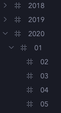
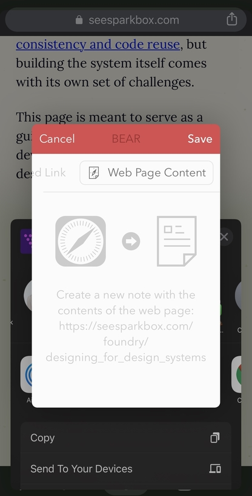
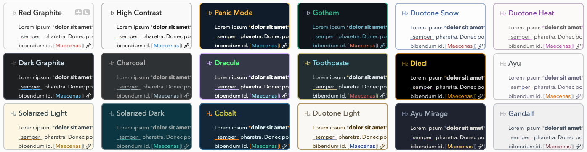

One great tool can change your entire workflow. It needs to be something you can take with you and use frequently. For some people, it’s a physical tool like a journal, a daily planner, a calendar, or an app. I’ve tried them all. After years of hopping between the complex systems of Evernote, OneNote, and Notion, I fell in love when I first tried [Bear](http://www.bear-writer.com/). It’s _so_ simple.

The tagline:

> Bear is a beautiful, flexible writing app for crafting notes and prose.

Beautiful it is. There’s a good reason it won the 2017 Apple Design Award. Not because of all the things they added to your typical word processor, but because of all they stripped away.


Credit: [Bear](https://www.bear-writer.com)

> A designer knows he has achieved perfection not when there is nothing left to add, but when there is nothing left to take away.
>
> \- Antoine de Saint-Exupery

Big toolbars are gone. Creating headings, subheadings, bold, italics, and block quotes are done with Markdown. Organization is simple and automatic.

The result is a delightful writing experience.

Bear is my constant companion. It’s always open on my computer, it’s on the face of my Apple Watch, and it’s in the home row of my iPhone. It’s my desert island app.

Bear is free for the basic features, but you get device sync and themes for \$20 a year.

## My Favorite Features

I’m going to walk you through some of my favorite features and explain how I use them to make my day more productive.

### Markdown Formatting

If you haven’t written with [Markdown](https://www.markdownguide.org/), it’s worth taking a few minutes to learn the basics. The big benefit is that your hands never need to leave the keyboard to do any kind of formatting.


You can also use the keyboard commands if you want to turn multiple lines into a bulleted list all at once.

### Tags

In Bear, you organize your notes with tags. Tags are a pretty common feature among apps like Evernote, but Bear makes them dead simple. Anywhere in your note (I put mine at the end usually) type a hashtag followed by the name of the tag. That’s it. Bear will find the tag in your writing and index it.

Better yet, if you want to nest tags, it’s as easy as putting forward slashes. I tag my writing with the date in YYYMMDD format to keep things organized. I type `#2020/01/15` and Bear nests my tags.



### Search

Bear doesn’t have folders or notebooks like Evernote. It keeps everything basically in one big bucket of notes. That’s why the search feature is so essential. Bear searches all words of all notes in an instant.

I don’t need to worry about organizing in folders because it’s all just one search away, and tags help me keep track of what needs to be sorted.

### Pinned Notes

Because Bear shifts notes to the top of the list when they’re updated, untouched notes move to the bottom of the pile. You can keep important notes at the top of your list by pinning them.

I do this usually with my “Blog Ideas” list. It makes adding to the list immediate so I never fail to capture a thought. When I need a writing idea the list is always handy.

### Syntax Highlighting

Bear is a great assistant for code editors like [VSCode](https://code.visualstudio.com/).

I’m constantly dropping code snippets into my notes to reference. Rather than searching Stack Overflow again for the same terminal command, I can paste it into Bear and quickly find it later.

Bear’s code syntax is the same as Markdown’s. One backtick for inline code, three backticks for a block of code. It even has syntax highlighting when you specify the language.

```javascript
const city = "Philadelphia";

function whereAmIFrom(city) {
  console.log(city);
}
```

### To-Do Lists

I use Bear to break down what I’m currently working on into smaller tasks so nothing is missed and next actions are obvious. Bear also keeps track of Todos across all your notes so they’re easier to find.


### Zoom In and Out

I know how simple this sounds. Hardly even a ‘feature’, but a keyboard shortcut that makes all the text bigger is something I use constantly. `cmd +` and `cmd -`

### Web Clipper + Share Integrations

Bear’s browser plugins are great for saving articles to read for later. Like Pocket and Instapaper, it strips the page down to just the article. I give the notes a `#readlater` tag so I can easily find them when I have time to read.


### Note Links

This lets you link to another note, which is great for an outline or index note that needs to reference another.

### Themes

Themes are part of the pro subscription (~\$20 a year) and are nice to have. The switch between dark and light themes throughout the day feels almost required in 2020 software.


## What I’d Love to See

Bear isn’t yet a perfect app, and I’d love to see a few things roll out in future updates.

### Tables

Not having even simple tables is a definite drawback. I know Markdown tables are clunky, but some kind of table solution would be wonderful.

### Universal Apps

Unfortunately, Bear is currently an Apple-exclusive. I’ve read that a web version is on the way, but it’s hard to say when that’ll happen. Honestly, Bear is one of the few reasons I haven’t left the Apple ecosystem. It’s that good.

### Grammarly Integration

I like to use Grammarly for revising any writing I’m publishing. Copying work from Bear to Grammarly’s editor and back isn’t a great workflow. I’m not sure which app is at fault, but I’d love an integration here.

### Versioning

One thing I like about Google Docs is the ability to roll back changes. A few other tools do this too, and I’d love to see this come to Bear.

## Wrap Up

I’m not affiliated with Bear in any way, I’m just a daily user. Over the years I’ve convinced about a dozen people to download and use Bear. I figure if I love it and they love it, you might too.

Like I said it’s free for all the basic features, so try it out and let me know what you think. Or tell me about _your_ preferred app in this space. I’m always ready to fall in love again.
