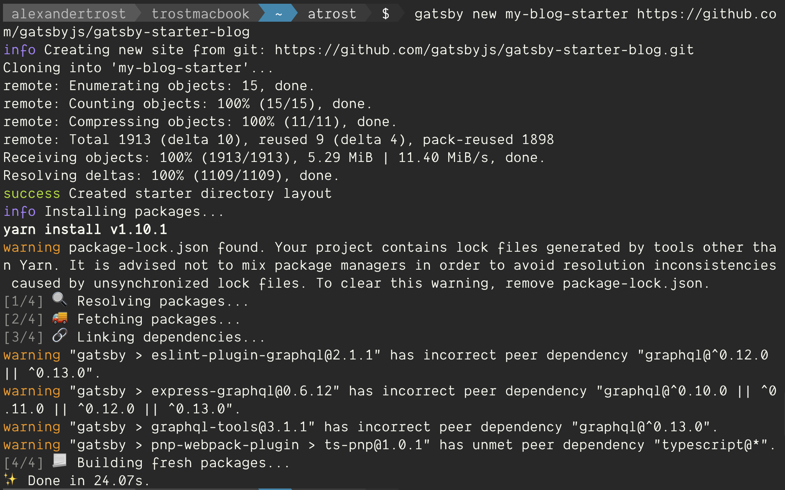
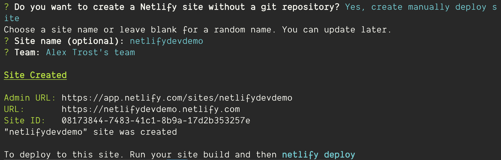
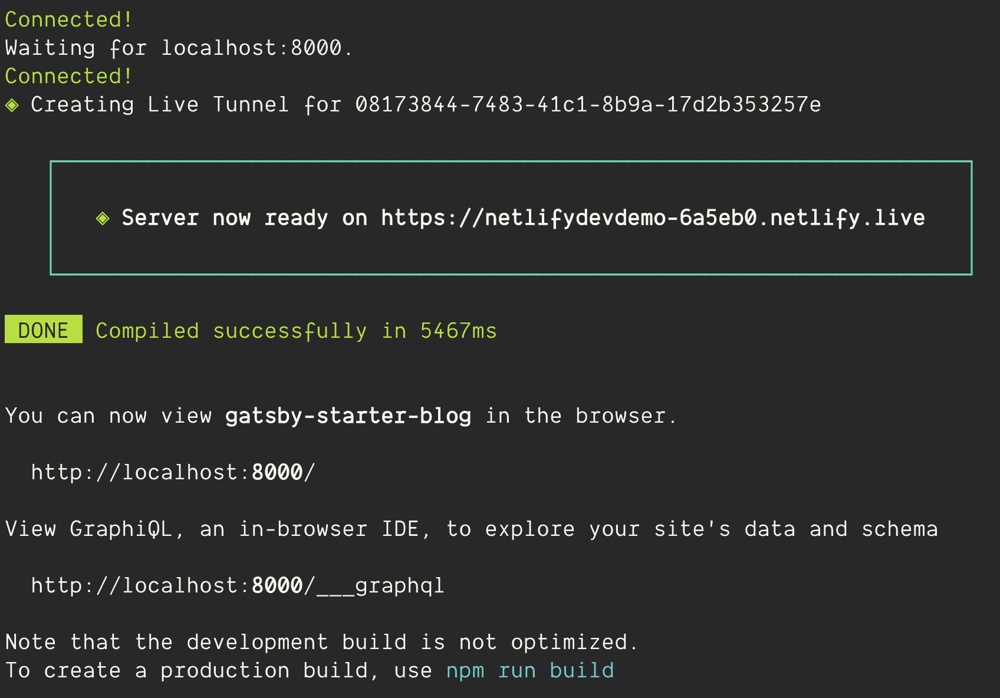
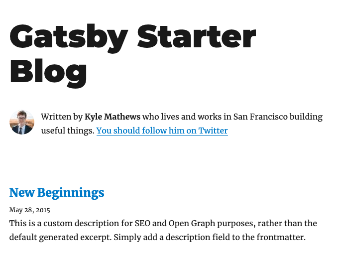

Netlify has been my favorite way to deploy sites ever since I pushed a React project and watched it go live in seconds.

It now hosts my personal site, my podcast’s site, and 20 other client sites or small pet projects that I wanted to put up on the web.

While it’s truly the simplest experience I’ve ever had, and the performance is second to none, I have found myself with small slowdowns in my work flow.

Basically I’d build my site or app on localhost by running Gatsby’s or Create React App’s development server. This gives you a great idea of how it looks, acts and behaves, but this is often where programmers say “Well it works on my machine.”

That’s clearly not the same as seeing how it works on Netlify’s actual platform. So when I find an issue I tweak some code, push the change, wait for Netlify to rebuild the site, and… Oh. That wasn’t it. Rinse and repeat.

Things like Netlify contact forms, environment variables, forwarding/routing and Netlify’s lambda functions needed to be pushed to be fully tested. Netlify has so many great features that I was using but had to deploy to get working.

## Problem, meet Solution

Netlify just addressed these issues and more with [Netlify Dev](https://www.netlify.com/products/dev/#how-it-works).

Announcing it at the [JAMStack Conference in NYC](https://jamstackconf.com/nyc/), Netlify CEO Matt Biilmann drew quite a few “whoa”s from the crowd as he live-demoed it.

[Phil Hawksworth’s Blog Post](https://www.netlify.com/blog/2019/04/09/netlify-dev--our-entire-platform-right-on-your-laptop/) does a great job of going into the team’s thought process and reasons for creating the new feature.

Now, with Netlify Dev, I can run their entire platform on my laptop with the Netlify CLI. Even offline.

Let’s give it a try!

## Install the CLI

You’ll need a Netlify account for this tutorial. [Signing up](https://app.netlify.com/signup) is completely free.

First we’ll install the Netlify CLI (Command Line Interface), so head to your terminal and run this command.

```shell
npm install netlify-cli -g
```

We’re going to be creating and working on a Gatsby site so let’s install the Gatsby CLI if you don’t already have it installed.

```shell
npm install -g gatsby-cli
```

## Create your project

We’re just going to start with a simple Gatsby Starter Blog project. In the directory you’d like to create your project run:

```shell
gatsby new my-blog-starter https://github.com/gatsbyjs/gatsby-starter-blog
```



Gatsby will clone the repo and install all the dependencies so we’re ready to go.

Then move into the folder we just created:

```shell
cd my-blog-starter/
```

## Initialize the Netlify project

At this point we’d normally run Gatsby’s built in dev server but not today. To use Netlify’s dev server we first need to initialize Netlify in the directory.

```shell
netlify init
```


We haven’t set up a git remote repo with this project, so Netlify is going to yell at us a little bit. Normally we would, but for the sake of this demo, let’s skip it and choose `Yes, create manually deploy site`. Then add a unique site name and choose your team.



If you head to your Netlify.com admin panel, you’ll see that Netlify is aware of our project. Great!


And back in our Gatsby project Netlify has installed a `.netlify` folder with a `state.json` file which lets Netlify know what project this is on their servers.

## Start the Live Dev server

Now we’re ready for the magic trick.

```shell
netlify dev --live
```

Netlify Dev identifies our project as Gatsby and automatically runs Gatsby’s development server, but within Netlify Dev.

When it’s done you should see a message like this:



In the green box it gives you the URL to your live site: `Server now ready on https:\\…netlify.live`

Go ahead and send that link to your sister across the country. She’ll be able to see your site, and its changes, in real time. You can check it out right now on your phone.

When you close your laptop or kill the server, it’s gone from the internet.

## Take it for a Spin

Now that our site is live, let's change some files, save them, and watch it update.

Open the netlify.live link that was generated for you. Open it on your desktop and phone if you have it handy. It's more fun with more devices.

You should see this spiffy Gatsby Starter Blog.



Open up `gatsby-config.js` in the root directory and you'll see where this site is getting a lot of its metadata. Let's change the `title` attribute to anything else. Here's mine:


Hit save and almost instantly anyone viewing that link will see the update.


And that's it!

## Conclusion

Normally if I'm working on a site and don't need to share it with anyone, I'd use `localhost:8000` with Netlify Dev. I still get all the features and logic of Netlify's platform without having to go through any servers.

Gatsby’s local development server is already a pleasure to work with because of how quickly it updates the page when you change something.

Now you can extend that workflow remotely with a client or colleague in real time.

No need to share your screen. Share the live site.

This is just scraping the surface of the features Netlify offers through Dev. [Check out all the features it offers](https://www.netlify.com/products/dev/) and try it for yourself. Let me know if you’d like to see me review any of the other Netlify features.

I see myself developing almost solely in Netlify Dev for all the added benefits it brings our way.

In my experience with small changes the live site updates in about 1 second or less. Try it out and let me know if you have any trouble on Twitter [@TrostCodes](https://twitter.com/TrostCodes).
