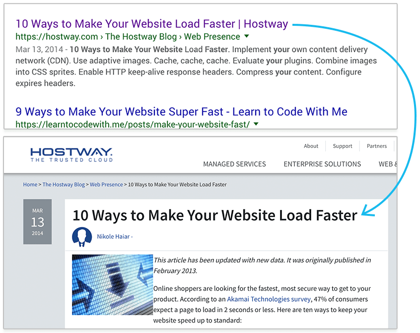

## There is no substitute

I know some web designers think that because they can toss a class onto a `
` or `` element to make it big and bold, it’s easier to use that. You might have been annoyed by the browser’s default margin or line height for header elements like `<h1>`.

You figure you can just use CSS to solve the problem. So you fill the entire site with all text inside `
` tags and nothing else.

You’ve now made your site worse for SEO and Accessibility.

Yes, it looks the same to you as if you had used header tags, but search engines and screen readers don’t interpret sites based on what text is biggest. They look for header tags.

## Hierarchy

The rule is that your page should have just one h1. This tells the user and browser what the most important thing on the page is.

From there, the page can be broken into subheadings as h2 elements, and so on with h3, h4, h5 and h6.

Honestly, I haven’t had to use many h4, h5 or h6 elements, so unless your content is incredibly complex, you’ll probably just use the top 3.

Don’t skip from h1 to h3, it throws the hierarchy for users and screen readers. If you want the subheadings to be smaller, change the css styles, not the html.

## User Experience

You want to have your headers stand out from the rest of your page. Your H1 should be the first thing visitors see on your page. Why?

Well if on Google they clicked “10 Ways to Make your Website Faster”, they’re going to expect to see the same message as soon as they land on your site.

The link they click on Google is the text between your `<title>` tag. What they see on your site is what’s between your `<h1>`

Make it large and noticeable so you reinforce what the page is about. Don’t change the text too much between your title and h1 tags or the user will be confused.
